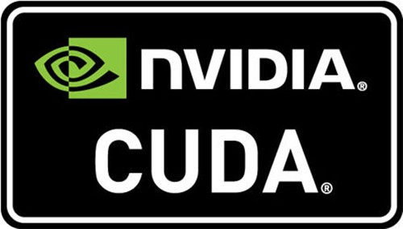

# Headings

## Hello Markdown!
### Hi there.
**Markdown** is bold text.
*Markdown* is italic text.
~~Markdown~~ is striked.
**_Markdown_** is bold and italic text.

# Quoting code
```
git init
git add
git commit
```

# Make text linked
[Markdown](www.baidu.com)

# Lists
- Jianping Deng
- Eric
- Nick
1. Jianping Deng
2. Eric
3. Nick

## Nested Lists
1. Jianping Deng
	1. 30
	2. 171
2. Eric
	1. 27
	2. 181
3. Nick
  * 29
  * 177

# Task lists
- [x] This is checked by what.
- [ ] No one checks here.
- [ ] Lonely

# Mentioning users and teams
@Dengjianping
```
Typing an @ symbol will bring up a list of people or teams on a project. 
The list filters as you type, so once you find the name of the person or 
team you are looking for, you can use the arrow keys to select it and hit 
either tab or enter to complete the name. For teams, just enter the 
@organization/team-name and all members of that team will get subscribed to the issue.
The autocomplete results are restricted to repository collaborators and 
any other participants on the thread.
```

# Use emoji
:shipit: :neckbeard:
:sleeping: :purple_heart:
[emoji code link](http://www.webpagefx.com/tools/emoji-cheat-sheet/)

#Code highlight
```cpp
int a = 9;
int b = 2;
int c = a + b;
```
```c
int a = 9;
int b = 2;
int c = a + b;
```
```js
var a = 4;
var b = 5;
```